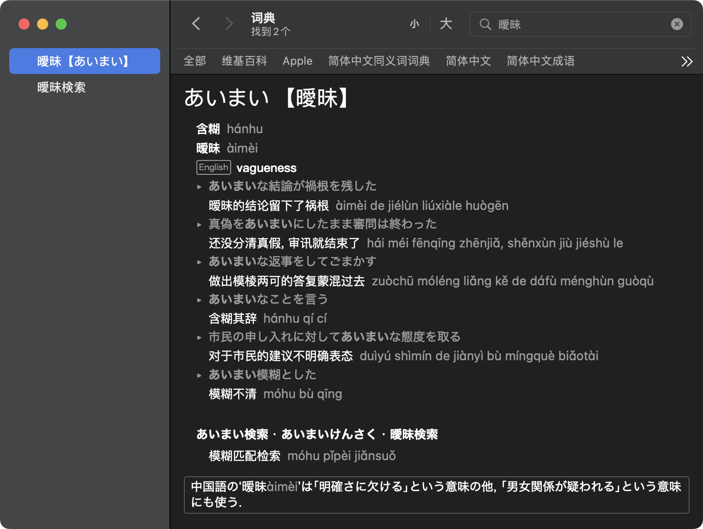

# apple-dictionary-extractor

[English](./README.md) | 简体中文

我在一篇令人兴奋的[博客](https://fmentzer.github.io/posts/2020/dictionary/)中了解到 Apple Dictionary 数据文件的结构，感谢作者 fmentzer！

这个工具用于从 Apple Dictionary 数据文件中提取条目。 Apple Dictionary 是用于查询各种语言的单词的应用程序，可以在 macOS 和 iOS 中使用。

支持的词典：

| 名称          | 特性                       |
| ------------- | -------------------------- |
| 简体中文-日语 | 解析为 json 并保存到数据库 |

## 运行方式

**1**: 检查字典数据是否已经在 Apple Dictionary (macOS) 中下载。

**2**: 在 `/System/Library/AssetsV2/com_apple_MobileAsset_DictionaryServices_dictionaryOSX` 中搜寻数据文件，并复制到 `apple-dictionary-extractor/data`。例如，字典《简体中文-日语》位于 `AssetData/Simplified Chinese - Japanese.dictionary/Contents/Resources/Body.data`。

**3**: 配置 `main.py` 然后运行 `python main.py`。

## 例子

Apple Dictionary 中词语“曖昧”的搜索结果。



词语“曖昧”解析为 json 的结果。

```json
{
    "title": "曖昧",
    "idx": "j_CRJC000136",
    "prn": "あいまい",
    "kanjis": [
        "曖昧"
    ],
    "defs": [
        {
            "order": "1",
            "chi_transs": [
                "含糊",
                "暧昧"
            ],
            "eng_transs": [
                "vagueness"
            ],
            "sent_exs": [
                {
                    "jpn_sent": "あいまいな結論が禍根を残した",
                    "chi_sent": "暧昧的结论留下了祸根"
                },
                {
                    "jpn_sent": "真偽をあいまいにしたまま審問は終わった",
                    "chi_sent": "还没分清真假, 审讯就结束了"
                },
                {
                    "jpn_sent": "あいまいな返事をしてごまかす",
                    "chi_sent": "做出模棱两可的答复蒙混过去"
                },
                {
                    "jpn_sent": "あいまいなことを言う",
                    "chi_sent": "含糊其辞"
                },
                {
                    "jpn_sent": "市民の申し入れに対してあいまいな態度を取る",
                    "chi_sent": "对于市民的建议不明确表态"
                },
                {
                    "jpn_sent": "あいまい模糊とした",
                    "chi_sent": "模糊不清"
                }
            ]
        }
    ],
    "phrs": [
        {
            "idx": "j_CRJC000136-HG001",
            "titles": [
                "あいまい検索",
                "あいまいけんさく",
                "曖昧検索"
            ],
            "secs": [
                {
                    "transs": [
                        "模糊匹配检索"
                    ]
                }
            ]
        }
    ]
}
```

